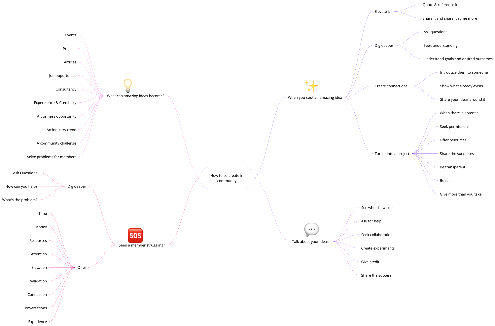

# Get involved

## How do I get startedy?

* [x] Join the community by signing up [**here**](https://forms.office.com/pages/responsepage.aspx?id=vBFqbZpG30ilSNPzU6wb6KOYGqI-gNhHpwX37PVCtN5URUtTTVhYTTY0NzlRQVFMTktBSllaVVpJTi4u\&route=shorturl) :writing\_hand:
* [x] Once you've filled in the form, we'll send you an invitation to join the [**Slack Community**](https://investec-dev-com.slack.com/archives/C05M7DZD0B1)
* [x] Book a welcome call with our Community Lead, Nick Benson, [**here**](https://outlook.office365.com/owa/calendar/CommunityWelcomeCalls@investeceu.onmicrosoft.com/bookings/) :telephone:

## How can I participate?

There are plenty of ways to be active in the community. If you're new to community, or are starting to get back into things, there is something for everyone.

<table data-full-width="false"><thead><tr><th width="325">How to participate</th><th>Getting started</th></tr></thead><tbody><tr><td>⌨️ <strong>Start a Slack conversation</strong></td><td>
<strong>#00_townhall :</strong> General chat for Programmable Banking <strong>#02_buildspace:</strong> Let us know what you're making/building

<strong>#01_howzit:</strong> Say hi!
</td></tr><tr><td>🍕<strong>Attend a meetup</strong></td><td>Check out upcoming events <a href="https://lu.ma/pb-community"><strong>here</strong></a><strong>.</strong></td></tr><tr><td>🎙️<strong>Demo or host at a meetup</strong></td><td>Get in touch with us (<a href="mailto:developercommunity@investec.co.za">developercommunity@investec.co.za</a>) about demoing your project or hosting.</td></tr><tr><td>🛠️ <strong>Sign up for a build challenge</strong></td><td>Take a look at our open build challenges <a href="../get-building/build-events/"><strong>here</strong></a>.</td></tr><tr><td>💻 <strong>Build and share an open source project/library</strong></td><td>View all the fantastic community projects <a href="https://github.com/Investec-Developer-Community/Community-Projects"><strong>here</strong></a> for inspiration.</td></tr><tr><td>🙋<strong>Give product feedback</strong></td><td>Upvote or log new feature requests <a href="https://programmable-banking-community.canny.io/"><strong>here</strong></a><strong>.</strong> </td></tr><tr><td>🎟️ <strong>Open a support ticket</strong></td><td>Log a support ticket <strong>.</strong></td></tr><tr><td>🏃‍♂️ <strong>Send more than 1000 API calls</strong></td><td>Get started on the API <a href="../get-started/api-quick-start-guide/"><strong>here</strong></a>.</td></tr><tr><td>📩 <strong>Read the newsletter</strong></td><td>Get monthly updates on whats happening in the community.</td></tr><tr><td>💬 <strong>Share a post on LinkedIn</strong></td><td>Help us spread the word. Follow Investec Developer <a href="https://www.linkedin.com/showcase/investecdeveloper/posts/?feedView=all"><strong>here</strong></a></td></tr></tbody></table>

## Becoming a community champ

We run a [**community champions program**](community-champions.md), where our most engaged community members are recognised and rewarded for their efforts in supporting and contributing to the community.

Our community champs enable and support others to grow and learn and are integral to the community.

👉 You can request to join the Champs program or nominate a fellow community member [**here**](https://jf18emj1p49.typeform.com/to/w75Wtkts).

## What's the swag like?

Check out a few things we give to awesome community members who live [**our core principles and values**](community-manifesto.md#core-principles-and-values)**.** 👇

## &#x20;How we think about co-creation in the community

<figure><figcaption>
How to co-create in the community
</figcaption></figure>


If you have an idea or want to find out how to get more involved in the community, reach out to us at [developercommunity@investec.co.za](mailto:developercommunity@investec.co.za) or schedule 15 minutes to chat [here](https://calendly.com/nick-offerzen/community-welcome-chat?month=2023-06).

