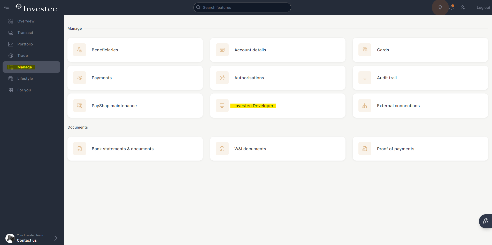
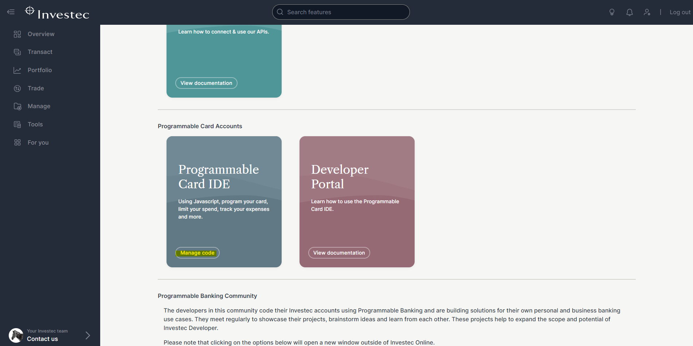
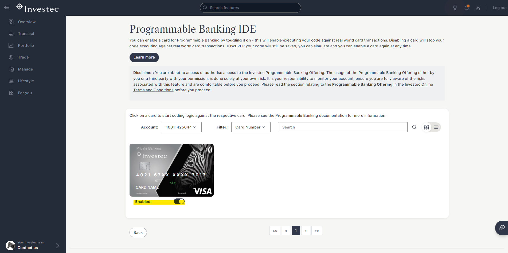

# 🙌 How to activate your card for Programmable Banking

* Navigate to [Investec Online Banking](https://login.secure.investec.com/wpaas/usrroot-wpaas/login/form) and login with your details.
* Once you have logged in, you will be presented with your profile.&#x20;
* On the left-hand side menu, go to _Manage -> Investec Developer._

<figure><figcaption></figcaption></figure>

* Once enrolled, you can click on “_Manage code_” under “_Programmable Card IDE_”:

<figure><figcaption>
Edit card code from here.
</figcaption></figure>

* Navigate to the desired card on your profile and ensure that you have enabled it for Programmable Banking by toggling the button below the card.

<figure><figcaption>
Toggle to enabled.
</figcaption></figure>

* To open up the IDE, you can click on the card image. Alternatively, the card code can also be updated via the APIs.


**ProTip:** You can enable and disable the code on each card using the toggle below the cards. You can access this via the mobile app if you need to do so while at the shop till.

