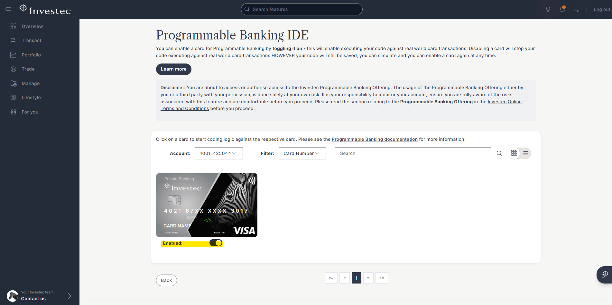

# Self-Enrollment Guide

1️⃣ The client can click on “**Manage**” in the left-hand menu, then click on “**Investec Developer**”:

<figure><figcaption>
Click "Investec Developer" to start the enrollement.
</figcaption></figure>

They can then enroll for Programmable Banking.

2️⃣ Once enrolled, they can click on “Manage code” under “Programmable Card IDE”:

<figure><figcaption>
Edit card code from here.
</figcaption></figure>

3️⃣ They will be presented with a list of their cards. Below the card is a toggle. They can switch that to enabled, and then the card is ready to be coded:

<figure><figcaption>
Click the card image to open the IDE
</figcaption></figure>

4️⃣ To open up the IDE, they can click on the card image. Alternatively, the card code can also be updated via the APIs.

All the documentation is available on our [Investec Developer Portal here.](https://developer.investec.com/)
